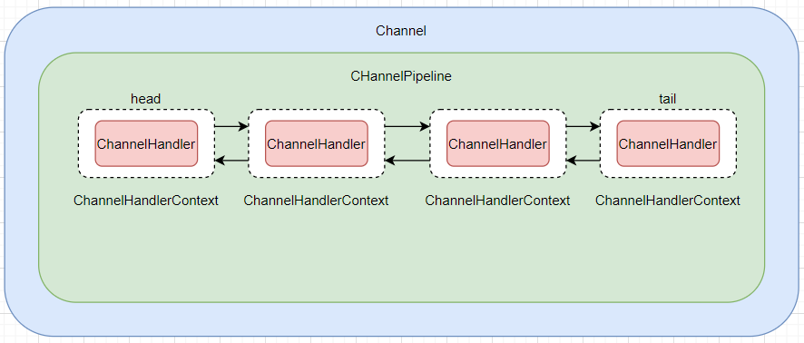

# Netty 核心组件

- Channel
- Callback
- Future
- Event & ChannelHandler

## Channel

> Channel 是 Java NIO 的一个基础构造
>
> Channel 是`入站`或`出站`数据的载体。因此它可以被打开、关闭或者连接、断开连接
>

## Callback

> Netty 内部使用回调来处理事件；当一个回调被触发时，相关的事件可用被一个 `ChannelHandler` 接口的实现来处理
>

```java
public class Callback extends ChannelInboundHandlerAdapter {
    @Override
    public void channelActive(ChannelHandlerContext ctx) throws Exception {
        System.out.println("建立新连接");
    }
}
```

## Future

> Future 提供了某种操作完成时通知应用程序的方式
>

### ChannelFuture

> ChannelFuture 用于执行异步操作的时候使用
>
> 它提供了额外的方法，能够帮助我们注册一个或者多个 `ChannelFutureListener` 实例
>
> 监听器的回调方法`operationComplete()`将会在对应的操作完成时调用
>
> 然后监听器可以判断该操作是否成功
>
> 如果失败可以检索产生的 `Throwable`
>
> 每一个Netty出战的 I/O 操作都会返回一个ChannelFuture
>

```java
Bootstrap bootstrap = new Bootstrap();
// 连接远程节点
ChannelFuture future = bootstrap.connect("127.0.0.1", 8880).sync();
future.addListener(new ChannelFutureListener() { // 注册一个 ChannelFutureListener，在完成操作时获得通知 
    @Override
    public void operationComplete(ChannelFuture future) throws Exception {
        if (future.isSuccess()) {
            // 如果操作成功则做一些操作
            System.out.println("操作成功");
        } else {
            // 失败，打印堆栈信息，或者其他操作
            Throwable cause = future.cause();
            cause.printStackTrace();
        }
    }
});
```

## Event & ChannelHandler

> Netty 使用不同的事件来通知我们状态的改变或者是操作的改变，这样可以让我们基于已经发生的事件来触发适当的操作
>
> 每一个事件都可以被分发到 ChannelHandler 类中的某个用户实现的方法
>
> 例如：记录日志、数据转换、流控制、应用程序逻辑
>

### Netty 入站相关事件

- 连接已被记过或者连接失活
- 数据读取
- 用户事件
- 错误事件

### Netty 出站相关事件

- 打开或者关闭到远程节点的连接
- 将数据写道或者冲刷到套接字

# Netty 快速开始

## 引入依赖

### pom.xml

```xml
    <dependencies>
        <!-- Netty -->
        <dependency>
            <groupId>io.netty</groupId>
            <artifactId>netty-all</artifactId>
            <version>4.1.48.Final</version>
        </dependency>
        <!-- 以下为日志依赖，可省略 -->
        <dependency>
            <groupId>ch.qos.logback</groupId>
            <artifactId>logback-classic</artifactId>
            <version>1.2.3</version>
            <scope>compile</scope>
        </dependency>
        <dependency>
            <groupId>org.apache.logging.log4j</groupId>
            <artifactId>log4j-to-slf4j</artifactId>
            <version>2.13.3</version>
            <scope>compile</scope>
        </dependency>
        <dependency>
            <groupId>org.slf4j</groupId>
            <artifactId>jul-to-slf4j</artifactId>
            <version>1.7.30</version>
            <scope>compile</scope>
        </dependency>
    </dependencies>
```

## 服务端
### NettyServer

```java
import io.netty.bootstrap.ServerBootstrap;
import io.netty.channel.ChannelFuture;
import io.netty.channel.ChannelInitializer;
import io.netty.channel.ChannelOption;
import io.netty.channel.EventLoopGroup;
import io.netty.channel.nio.NioEventLoopGroup;
import io.netty.channel.socket.SocketChannel;
import io.netty.channel.socket.nio.NioServerSocketChannel;
import org.slf4j.Logger;
import org.slf4j.LoggerFactory;

public class NettyServer {

    private final static Logger logger = LoggerFactory.getLogger(NettyServer.class);

    public static void main(String[] args) throws InterruptedException {
        /**
         * bossGroup：只负责处理连接请求
         */
        EventLoopGroup bossGroup = new NioEventLoopGroup();
        EventLoopGroup workGroup = new NioEventLoopGroup();
        try {

            // 创建服务器端的启动对象，配置参数
            ServerBootstrap bootstrap = new ServerBootstrap();
            bootstrap
                    // 设置两个线程组
                    .group(bossGroup, workGroup)
                    // 设置服务端的通道实现
                    .channel(NioServerSocketChannel.class)
                    // 设置线程队列得到连接个数
                    .option(ChannelOption.SO_BACKLOG, 128)
                    // 设置保持活动连接状态
                    .childOption(ChannelOption.SO_KEEPALIVE, true)
                    // 设置 workGroup 的 EventLoop 对应的通道设置处理器
                    .childHandler(new ChannelInitializer<SocketChannel>() { // 创建一个通道初始化对象
                        // 给 pipeline 设置处理器
                        @Override
                        protected void initChannel(SocketChannel ch) throws Exception {
                            ch.pipeline().addLast(new NettyServerHandler());
                        }
                    });

            logger.info("服务端准备完成");

            // 绑定端口，设置为同步，并且启动服务器
            ChannelFuture cf = bootstrap.bind(6666).sync();
            // 监听关闭通道
            cf.channel().closeFuture().sync();
        } finally {
            // 优雅的关闭
            bossGroup.shutdownGracefully();
            workGroup.shutdownGracefully();
        }
    }
}
```

### NettyServerHandler

```java
import io.netty.buffer.ByteBuf;
import io.netty.buffer.Unpooled;
import io.netty.channel.ChannelFutureListener;
import io.netty.channel.ChannelHandlerContext;
import io.netty.channel.ChannelInboundHandlerAdapter;
import io.netty.util.CharsetUtil;
import org.slf4j.Logger;
import org.slf4j.LoggerFactory;

@ChannelHandler.Sharable
public class NettyServerHandler extends ChannelInboundHandlerAdapter {

    private final static Logger logger = LoggerFactory.getLogger(NettyServerHandler.class);

    /**
     * 对于每个传入的消息都会调用
     * @param ctx   上下文对象，包含 pipeline(管道)、channel(通道)、地址
     * @param msg   客户端传递来的消息
     * @throws Exception
     */
    @Override
    public void channelRead(ChannelHandlerContext ctx, Object msg) throws Exception {
        ByteBuf buf = (ByteBuf) msg;
        // 将接收到的消息写给客户端，而不冲刷出站消息
        ctx.write(buf);
    }

    /**
     * 通知 ChannelInboundHandler 最后一次对 channelRead() 的调用是当前批量读取中的最后一条消息
     * @param ctx
     * @throws Exception
     */
    @Override
    public void channelReadComplete(ChannelHandlerContext ctx) throws Exception {
        // 将暂存于 ChannelOutboundBuffer 中的消息冲刷到远程节点，
        // 并在下一次调用flush()或者writeAndFlush()方法时将会尝试写出到套接字
        ctx.writeAndFlush(Unpooled.EMPTY_BUFFER)
                // 监听消息冲刷完毕后关闭该 Channel
                .addListener(ChannelFutureListener.CLOSE);
    }

    /**
     * 的读取操作期间，有异常抛出时调用
     * @param ctx
     * @param cause
     * @throws Exception
     */
    @Override
    public void exceptionCaught(ChannelHandlerContext ctx, Throwable cause) throws Exception {
        // 打印堆栈异常
        cause.printStackTrace();
        // 关闭 Channel
        ctx.close();
    }
}
```

## 客户端

### NettyClient
```java
import io.netty.bootstrap.Bootstrap;
import io.netty.channel.ChannelFuture;
import io.netty.channel.ChannelInitializer;
import io.netty.channel.EventLoopGroup;
import io.netty.channel.nio.NioEventLoopGroup;
import io.netty.channel.socket.SocketChannel;
import io.netty.channel.socket.nio.NioSocketChannel;
import org.slf4j.Logger;
import org.slf4j.LoggerFactory;

public class NettyClient {

    private final static Logger logger = LoggerFactory.getLogger(NettyClient.class);

    public static void main(String[] args) throws InterruptedException {
        // 客户端 需要一个循环组
        EventLoopGroup eventExecutors = new NioEventLoopGroup();

        try {
            // 客户端启动对象
            // 服务端使用 ServerBootstrap 而客户端是使用 Bootstrap
            Bootstrap bootstrap = new Bootstrap();
            bootstrap
                    // 设置线程组
                    .group(eventExecutors)
                    // 设置客户端通道的实现
                    .channel(NioSocketChannel.class)
                    .handler(new ChannelInitializer<SocketChannel>() {
                        @Override
                        protected void initChannel(SocketChannel ch) throws Exception {
                            ch.pipeline().addLast(new NettyClientHandler());
                        }
                    });

            logger.info("客户端准备完成");

            // 启动客户端并连接服务端
            ChannelFuture future = bootstrap.connect("127.0.0.1", 6666).sync();
            // 监听关闭通道
            future.channel().closeFuture().sync();
        } finally {
            eventExecutors.shutdownGracefully();
        }
    }
}
```

### NettyClientHandler

```java
import io.netty.buffer.ByteBuf;
import io.netty.buffer.Unpooled;
import io.netty.channel.ChannelHandlerContext;
import io.netty.channel.ChannelInboundHandlerAdapter;
import io.netty.util.CharsetUtil;
import org.slf4j.Logger;
import org.slf4j.LoggerFactory;

public class NettyClientHandler extends ChannelInboundHandlerAdapter {

    private final static Logger logger = LoggerFactory.getLogger(NettyClientHandler.class);

    /**
     * 当通道就绪时触发
     * @param ctx
     * @throws Exception
     */
    @Override
    public void channelActive(ChannelHandlerContext ctx) throws Exception {
        logger.info("client : {}", ctx);
        ctx.writeAndFlush(Unpooled.copiedBuffer("Hello Client", CharsetUtil.UTF_8));
    }

    /**
     * 读取服务端发送的消息
     * @param ctx
     * @param msg
     * @throws Exception
     */
    @Override
    public void channelRead(ChannelHandlerContext ctx, Object msg) throws Exception {
        ByteBuf buf = (ByteBuf) msg;
        logger.info("服务端回复的消息 : {}", buf.toString(CharsetUtil.UTF_8));
        logger.info("服务器的地址 : {}", ctx.channel().remoteAddress());
    }

    @Override
    public void exceptionCaught(ChannelHandlerContext ctx, Throwable cause) throws Exception {
        cause.printStackTrace();
        ctx.close();
    }
}
```

# 任务调度

## TaskQueue 任务队列

```java
    public void channelRead(ChannelHandlerContext ctx, Object msg) throws Exception {
        logger.info("server context : {}", ctx);

        // 定义 taskQueue 实现异步任务。解决 : 业务时间过长导致长时间阻塞
        ctx.channel().eventLoop().execute(new Runnable() {
            @Override
            public void run() {
                try {
                    Thread.sleep(10 * 1000);
                } catch (InterruptedException e) {
                    e.printStackTrace();
                }
                ctx.writeAndFlush(Unpooled.copiedBuffer("Hello Netty2~", CharsetUtil.UTF_8));
            }
        });

        ByteBuf buf = (ByteBuf) msg;
        logger.info("客户端发送的消息是 : {}", buf.toString(CharsetUtil.UTF_8));
        logger.info("客户端的地址是 : {}", ctx.channel().remoteAddress());
    }
```

## scheduledTaskQueue 定时任务队列

```java
    public void channelRead(ChannelHandlerContext ctx, Object msg) throws Exception {
        logger.info("server context : {}", ctx);

        // 参数一：业务实现、参数二：延迟时间、参数三：时间单位
        ctx.channel().eventLoop().schedule(new Runnable() {
            @Override
            public void run() {
                try {
                    Thread.sleep(10 * 1000);
                } catch (InterruptedException e) {
                    e.printStackTrace();
                }
                ctx.writeAndFlush(Unpooled.copiedBuffer("Hello Netty2~", CharsetUtil.UTF_8));
            }
        }, 5, TimeUnit.SECONDS);

        ByteBuf buf = (ByteBuf) msg;
        logger.info("客户端发送的消息是 : {}", buf.toString(CharsetUtil.UTF_8));
        logger.info("客户端的地址是 : {}", ctx.channel().remoteAddress());
   }
```

# FutureListener 监听器

> Future 对象刚刚创建时，处于非完成状态，调用者可以通过返回的 `ChannelFuture` 来获取操作执行的状态，注册监听函数来执行完成后的操作

```java
// 绑定端口，设置为同步，并且启动服务器
ChannelFuture cf = bootstrap.bind(6666).sync();
// 添加监听器
cf.addListener(new ChannelFutureListener() {
    @Override
    public void operationComplete(ChannelFuture future) throws Exception {
        if (cf.isSuccess()) {
            logger.info("监听端口 6666 成功");
        } else {
            logger.error("监听端口 6666 失败");
        }
    }
});
```

# BootStrap、ServerBootStrap

> BootStrap: 只要用于配置整个 Netty 程序、串联各个组件
> Netty 中的 BootStrap 类是客户端程序的启动引导类、ServerBootStrap 是服务端启动引导类

## 常用方法

```java
// 在服务端设置两个EventLoop
public ServerBootstrap group(EventLoopGroup parentGroup, EventLoopGroup childGroup) {}
// 在客户端设置一个EventLoop
public B group(EventLoopGroup group) {}
// 设置一个服务器端的通道实现
public B channel(Class<? extends C> channelClass) {}
// 用来给 ServerChannel 添加配置
public <T> B option(ChannelOption<T> option, T value) {}
// 用来给接收到的通道添加配置
public <T> ServerBootstrap childOption(ChannelOption<T> childOption, T value) {}
// 设置服务端的端口
public ChannelFuture bind(int inetPort) {}
// 提供给客户端连接服务端
public ChannelFuture connect(String inetHost, int inetPort) {}
```

# Future、ChannelFuture

> Netty 中所有的 IO 操作都是异步的、不能立刻得知消息被正确处理
>
> 但是可以等待执行完成或者注册监听器，具体通过 Future、ChanelFutures 来注册监听器
>
> 当操作成功或者失败的时候会去执行注册的监听器
>

## 常用方法

```java
// 返回当前正在执行IO的操作的通道
Channel channel();
// 等待异步执行完毕
ChannelFuture sync() throws InterruptedException;
```

# Channel

1. Netty 网络通信的组件，能够用于执行网络 I/O 操作
2. 通过 Channel 可获得当前网络连接通道的状态、配置参数（例如接收缓冲区大小）
3. Channel 提供异步的网络 I/O 操作（如建立连接、读写、绑定端口）
4. 调用立即返回一个 ChannelFuture 实例，通过注册监听器到 ChannelFuture 上，可以在 I/O 操作成功、失败或取消时回调通知调用方
5. 支持关联 I/O 操作与对应的处理程序
6. 不同协议、不同的阻塞类型的连接都有不同的 Channel 类型与之对应

## 常用的 Channel 类型

- `NioSOcketChannel` : 异步的`客户端` `TCP Socket` 连接
- `NioServerSocketChannel` : 异步的`服务器端` `TOC Socket` 连接
- `NioDatagramChannel` : 异步的 `UDP` 连接
- `NioSctpChannel` : 异步的 `客户端` `Sctp` 连接
- `NioSctpServerChannel` : 异步的 `Sctp` `服务器端` 连接

# Selector

> Netty 基于 Selector 对象实现 I/O 多路复用，通过 Selector 一个线程可以监听多个连接的 Channel 事件
>
> 当向一个 Selector 中注册 Channel 后 Selector 内部的机制就可以自动不断的查询这些注册的 Channel 是否以有就绪的I/O事件
>
> 例如可读、可写、网络连接完成等
>
> 这样程序就可以很简单的使用一个下称高效的管理多个 Channel
>

# ChannelHandler

> ChannelHandler 是一个借口，用来处理 I/O 事件或拦截 I/O 操作
>
> 并将其转发到其他 ChannelPipeline(业务处理链)中的下一个处理程序

## ChannelHandler 实现类

- `ChannelInboundHandler` : 用于处理入站 I/O 事件
- `ChannelOutboundHandler` : 用于处理出栈 I/O 操作
- `ChannelInboundHandlerAdapter` : 用于处理入站 I/O 事件
- `ChannelOutboundHandlerAdapter` : 用于处理出栈 I/O 操作
- `ChannelDuplexHandler` : 用于处理入站和出战事件

## ChannelInboundHandlerAdapter 常用方法

```java
// 通道被注册事件
public void channelRegistered(ChannelHandlerContext ctx) throws Exception {}
// 通道被注销事件
public void channelUnregistered(ChannelHandlerContext ctx) throws Exception {}

// 通道处理就绪事件
public void channelActive(ChannelHandlerContext ctx) throws Exception{}
// 通道读取数据事件
public void channelRead(ChannelHandlerContext ctx, Object msg) throws Exception {}
// 数据读取完毕事件
public void channelReadComplete(ChannelHandlerContext ctx) throws Exception {}
// 通道发生异常事件
public void exceptionCaught(ChannelHandlerContext ctx, Throwable cause) throws Exception {}

// 当前 Handler 被 pipeline 注册时触发
public void handlerAdded(ChannelHandlerContext ctx) throws Exception {}
// 当前 Handler 被 pipeline 移除时触发
public void handlerRemoved(ChannelHandlerContext ctx) throws Exception {}
```

## @ChannelHandler.Sharable

> 表示一个 ChannelHandler 可以被多个 Channel 安全的共享
>
> Netty 会在每个 Channel 中都添加处理器，如果每个通道都创建一次对象，对内存的消耗无疑是非常大的
>
> 所以一般在线程安全的处理器中，都会标注此注解，表示可以只创建一次对象
>
> 一般在没有共享变量的处理器都可以加入此注解

# Pipeline & ChannelPipeline

> ChannelPipeline 是一个 Handler 的集合，负责处理和拦截 inbound 或者 outbound 的事件和操作
>
> 相当于一个贯穿Netty的链
>
> 简单说：ChannelPipeline 是一个用来保存 ChannelHandler 的集合，用来处理或拦截 Channel 的入站事件和出战操作
>
> ChannelPipeline 实现了一种高级形式的拦截过滤器模式，让用户可以完全控制事件的处理方式，以及 Channel 中各个的 ChannelHandler 的相互交互
>
> 在 Netty 中，每个 Channel 都仅有一个 ChannelPipeline，



> 一个 Channel 包含了一个 ChannelPipeline， 而 ChannelPipeline 中又维护了一个由 ChannelHandlerContext 组成的双向链表
>
> 并且每个 ChannelHandlerContext 中又关联着一个 ChannelHandler
>
> 入站事件和出战事件在一个双向链表中，入站事件会从链表 head 往后传递到最后一个入站的 handler
>
> 出战事件会从链表 tail 往前传递到最前一个出站的 handler， 两种类型的 handler 互不干扰
>

## 常用方法

```java
// 把 handler 添加到链表的最后一个位置
ChannelPipeline addLast(ChannelHandler... handlers);
// 把 handler 添加到链表的第一个位置
ChannelPipeline addFirst(ChannelHandler... handlers);
```


# ChannelHandlerContext

> 保存 Channel 相关的所有上下文信息，同时关联一个 ChannelHandler 对象
>
> ChannelHandlerContext 中包含一个具体的事件处理器 ChannelHandler
>
> 同时 ChannelHandlerContext 中也绑定了对应的pipeline 和 Channel 的信息，方便对 ChannelHandler 进行调用
>

## 常用方法

```java
// 关闭通道
ChannelFuture close();
// 刷新
ChannelHandlerContext flush();
// 将数据写到 ChannelPipeline 中，当前 CHannelHandler 的下一个 ChannelHandler 开始处理（出站）
ChannelFuture writeAndFlush(Object msg);
```

# ChannelOption

## ChannelOption.SO_BACKLOG

> 对应 TCP/IP 协议 Listen 函数中的 backlog 参数，用来初始化服务器可连接队列大小
>
> 服务端处理客户端链接请求是顺序处理的，所以同一时间只能处理一个客户端连接，多个客户端请求时，服务端不能处理的客户端连接请求放在队列中等待处理
>

## ChannelOption.SO_KEEPALIVE

> 是否保持连接活动状态

# EventLoopGroup & NioEventLoopGroup

> EventLoopGroup 是一组 EventLoop 的抽象，Netty 为了跟他好的利用多核 CPU 资源，一半会有多个 EventLoop 同时工作，每个 EventLoop 维护着一个 Selector 实例
>
> EventLoopGroup 提供 next 接口，可以重里面按照一定规则获取其中一个 EventLoop 来处理任务
>
> 在 Netty 服务器端编程中，我们一半都需要提供两个 EventLoopGroup，例如：BossEventLoopGroup 和 WorkerEventLoopGroup
>
> 通常一个服务端口即一个 ServerSocketChannel 对应一个 Selector 和一个 EventLoop 线程。
>
> BossEventLoop 负责接收客户端的连接并将 SocketChannel 交给 WorkerEventLoopGroup 来进行 IO 处理
>
> > BossEventLoopGroup 通常是一个单线程的 EventLoop，EventLoop维护者一个注册了 ServerSocketChannel 的 Selector 实例，BossEventLoop 不断轮询 Selector 将连接事件分离出来
> >
> > 通常是 OP_ACCEPT 事件，然后将接收到的 SocketChannel 交给 WorkerEventLoopGroup
> >
> > WorkerEventLoopGroup 会由 next 选择其中一个 EventLoopGroup 来将这个 SocketChannel 注册到其维护 Selector 并对其后续的 IO 事件进行处理

# Unpooled

> Unpooled 类是 Netty 用来操作 缓冲区的工具类

## 常用方法
```java
public static ByteBuf copiedBuffer(CharSequence string, Charset charset)
```

# 心跳机制

```java
package io.mvvm.netty.heart;

import io.netty.bootstrap.ServerBootstrap;
import io.netty.channel.*;
import io.netty.channel.nio.NioEventLoopGroup;
import io.netty.channel.socket.SocketChannel;
import io.netty.channel.socket.nio.NioServerSocketChannel;
import io.netty.handler.logging.LogLevel;
import io.netty.handler.logging.LoggingHandler;
import io.netty.handler.timeout.IdleStateHandler;
import org.slf4j.Logger;
import org.slf4j.LoggerFactory;

import java.util.concurrent.TimeUnit;

/**
 * @program: Netty
 * @description: 心跳机制-服务端
 * @author: 潘
 * @create: 2021-04-29 00:04
 **/
public class HeartServer {

    private final static Logger logger = LoggerFactory.getLogger(HeartServer.class);

    public static void main(String[] args) throws InterruptedException {

        EventLoopGroup bossGroup = new NioEventLoopGroup();
        EventLoopGroup workGroup = new NioEventLoopGroup();
        try {
            ServerBootstrap bootstrap = new ServerBootstrap();
            bootstrap
                    .group(bossGroup, workGroup)
                    .channel(NioServerSocketChannel.class)
                    .option(ChannelOption.SO_BACKLOG, 128)
                    .childOption(ChannelOption.SO_KEEPALIVE, true)
                    // handler 对应的是 bossGroup
                    // childHandler 对应的是 workGroup
                    // 日志处理器，提供给BossGroup打印日志
                    .handler(new LoggingHandler(LogLevel.INFO))
                    .childHandler(new ChannelInitializer<SocketChannel>() {
                        @Override
                        protected void initChannel(SocketChannel ch) throws Exception {
                            // 加入空闲状态处理器
                            // 参数一：多少时间没有读取消息，就会发送一个心跳，检测是否是连接状态
                            // 参数二：          写
                            // 参数三：          读写
                            // 参数四：时间单位
                            // 当 IdleStateHandler 触发后，会传递给通道的下一个 handler 处理
                            // 通过调用下一个 handler 的 userEventTriggered 方法
                            ch.pipeline().addLast(new IdleStateHandler(3, 5, 7, TimeUnit.SECONDS));
                            // 加入一个对空闲检测处理的handler
                            ch.pipeline().addLast(new HeartHandler());
                        }
                    });

            logger.info("服务端准备完成");

            ChannelFuture cf = bootstrap.bind(6668).sync();

            cf.addListener(new ChannelFutureListener() {
                @Override
                public void operationComplete(ChannelFuture future) throws Exception {
                    if (cf.isSuccess()) {
                        logger.info("监听端口 6666 成功");
                    } else {
                        logger.error("监听端口 6666 失败");
                    }
                }
            });

            cf.channel().closeFuture().sync();
        } finally {
            bossGroup.shutdownGracefully();
            workGroup.shutdownGracefully();
        }

    }

}
```

```java
package io.mvvm.netty.heart;

import io.netty.channel.ChannelHandlerContext;
import io.netty.channel.ChannelInboundHandlerAdapter;
import io.netty.handler.timeout.IdleStateEvent;

/**
 * @program: Netty
 * @description: 空闲状态处理器
 * @author: 潘
 * @create: 2021-04-29 00:18
 **/
public class HeartHandler extends ChannelInboundHandlerAdapter {
    /**
     * 
     * @param ctx
     * @param evt   事件
     * @throws Exception
     */
    @Override
    public void userEventTriggered(ChannelHandlerContext ctx, Object evt) throws Exception {
        if (evt instanceof IdleStateEvent) {
            IdleStateEvent ise = (IdleStateEvent) evt;
            switch (ise.state()) {
                case READER_IDLE:
                    System.out.println("读空闲");
                    break;
                case WRITER_IDLE:
                    System.out.println("写空闲");
                    break;
                case ALL_IDLE:
                    System.out.println("读写空闲");
                    break;
            }
        }
    }
}
```

# WebSocket

```java
package io.mvvm.netty.ws;

import io.netty.bootstrap.ServerBootstrap;
import io.netty.channel.*;
import io.netty.channel.nio.NioEventLoopGroup;
import io.netty.channel.socket.SocketChannel;
import io.netty.channel.socket.nio.NioServerSocketChannel;
import io.netty.handler.codec.http.HttpObjectAggregator;
import io.netty.handler.codec.http.HttpServerCodec;
import io.netty.handler.codec.http.websocketx.WebSocketServerProtocolHandler;
import io.netty.handler.stream.ChunkedWriteHandler;
import org.slf4j.Logger;
import org.slf4j.LoggerFactory;

/**
 * @program: Netty
 * @description: WebSocketServer
 * @author: 潘
 * @create: 2021-04-29 09:24
 **/
public class WebSocketServer {

    private final static Logger logger = LoggerFactory.getLogger(WebSocketServer.class);

    public static void main(String[] args) throws InterruptedException {

        EventLoopGroup bossGroup = new NioEventLoopGroup();
        EventLoopGroup workGroup = new NioEventLoopGroup();
        try {

            ServerBootstrap bootstrap = new ServerBootstrap();
            bootstrap
                    .group(bossGroup, workGroup)
                    .channel(NioServerSocketChannel.class)
                    .option(ChannelOption.SO_BACKLOG, 128)
                    .childOption(ChannelOption.SO_KEEPALIVE, true)
                    .childHandler(new ChannelInitializer<SocketChannel>() { // 创建一个通道初始化对象
                        @Override
                        protected void initChannel(SocketChannel ch) throws Exception {
                            // Http协议编解码器
                            ch.pipeline().addLast(new HttpServerCodec());
                            // 以块方式写,对大数据流的支持，例如文件传输
                            ch.pipeline().addLast(new ChunkedWriteHandler());
                            // 将多个数据段聚合起来，如果发送大文本数据避免请求多次
                            ch.pipeline().addLast(new HttpObjectAggregator(8192));
                            // 处理WebSocket握手以及处理控制帧
                            ch.pipeline().addLast(new WebSocketServerProtocolHandler("/ws"));

                            // 自定义Handler
                            ch.pipeline().addLast(new WebSocketMessageHandler());
                        }
                    });

            ChannelFuture cf = bootstrap.bind(5566).sync();
            cf.channel().closeFuture().sync();
        } finally {
            bossGroup.shutdownGracefully();
            workGroup.shutdownGracefully();
        }

    }

}
```

```java
package io.mvvm.netty.ws;

import io.netty.channel.ChannelHandler;
import io.netty.channel.ChannelHandlerContext;
import io.netty.channel.SimpleChannelInboundHandler;
import io.netty.handler.codec.http.websocketx.TextWebSocketFrame;

/**
 * @program: Netty
 * @description: 消息处理器, <TextWebSocketFrame> 表示一个文本帧
 * @author: 潘
 * @create: 2021-04-29 09:41
 **/
@ChannelHandler.Sharable
public class WebSocketMessageHandler extends SimpleChannelInboundHandler<TextWebSocketFrame> {

    @Override
    public void channelActive(ChannelHandlerContext ctx) throws Exception {
        System.out.println("客户端已连接");
    }

    @Override
    protected void channelRead0(ChannelHandlerContext ctx, TextWebSocketFrame msg) throws Exception {
        // 收到客户端发送的消息
        System.out.println(msg.text());

        // 向客户端回复消息
        ctx.channel().writeAndFlush(new TextWebSocketFrame("Hello WebSocket : " + msg.text()));
        
        // 动态删除当前处理器
        ctx.pipeline().remove(this);

    }

    @Override
    public void channelInactive(ChannelHandlerContext ctx) throws Exception {
        System.out.println("客户端断开连接");
    }

    @Override
    public void handlerAdded(ChannelHandlerContext ctx) throws Exception {
        System.out.println("处理器已添加");
    }

    @Override
    public void handlerRemoved(ChannelHandlerContext ctx) throws Exception {
        System.out.println("处理器被移除");
    }

    @Override
    public void exceptionCaught(ChannelHandlerContext ctx, Throwable cause) throws Exception {
        System.out.println("发生异常" + cause.getMessage());
        ctx.close();
    }
}

```

# Encoder & Decoder

> 网络应用程序在数据传输时采用二进制字节码数据，所以在发送数据时需要编码，接收数据时需要解码
>
> codec (编解码器)分别表示：Decoder(解码器)、Encoder(编码器)
>

## Netty 的编解码器

- StringEncoder & StringDecoder > String 类型数据的编解码器
- ObjectEncoder & ObjectDecoder > Java 对象的编解码器

> Netty 提供的 Object 编解码器采用的是Java的序列化方式，因此就存在效率低、无法跨语言、体积大等问题
>

## Google Protobuf

> Protobuf 是一种轻便高效的结构化数据存储格式，可以用于结构化数据串行化(序列化)

# 粘包 & 半包

> TCP 是面向流的，提供高可靠性服务。收发两端都要有成对的 Socket
>
> 因此发送端为了将多个发给接收端的包，更有效的发送给对方，使用了 Nagle 算法优化
>
> 将多次间隔较小且数量小的数据，合并为一个大的数据块，然后进行封包，
>
> 这样虽然提高了效率，但是接收端就难以分辨出完整的数据包了，因为面向流的通信是无消息保护边界的

## 粘包
### 现象

发送 `abc` `def`，接收为 `abcdef`

### 原因

- 应用层：接收方 ByteBuf 设置太大（Netty默认1024）
- 滑动窗口：假设发送方256bytes表示一个完整的报文，但由于接收方处理不及时且窗口大小足够大，这256bytes字节就会缓冲在接收方的滑动窗口中，当滑动窗口中缓冲了多个报文就会出现粘包
- Nagle 算法

## 半包

### 现象

发送 `abcdef` 接收 `abc` `de` `f`

### 原因

- 应用层：接收方 ByteBuf 小于实际发送数据的数量
- 滑动窗口：加涉接收方的窗口只剩128bytes，发送方的报文大小是256bytes，这时放不下了，只能先发送前128bytes，等待ack后才能发送剩余部分，这就造成半包
- MSS限制：当发送的数据草果 MSS 限制后，会将数据切分发送，就会照成半包

## 粘包半包演示

### 服务端

```java
    @Override
    public void channelRead(ChannelHandlerContext ctx, Object msg) throws Exception {
        ByteBuf buf = (ByteBuf) msg;
        logger.info("客户端发送的消息是 : {}", buf.toString(CharsetUtil.UTF_8));
    }
```

### 客户端

```java
    @Override
    public void channelActive(ChannelHandlerContext ctx) throws Exception {
        for (int i = 0; i < 10; i++) {
            ByteBuf buf = Unpooled.copiedBuffer("Hello Client" + i, CharsetUtil.UTF_8);
            ctx.writeAndFlush(buf);
        }
    }
```

### 结果打印

```log
[nioEventLoopGroup-3-1] INFO io.mvvm.netty.decoder.NettyServerHandler - 客户端发送的消息是 : Hello Client0Hello Client1Hello Client2Hello Client3Hello Client4Hello Client5Hello Client6Hello Client7Hello Client8Hello Client9
```

### 结论

> 代码解释
>
> 客户端和服务端建立连接后，循环向服务端发送10条消息
>
> 期望结果
>
> 服务端收到10条消息
>
> 实际结果
>
> 服务端将10条消息放在一起成为了一条消息，这就是粘包现象

## 解决方案

### 短连接

> 建立连接后只发送一次消息，发送消息完毕后断开连接
>
> 缺点：不如用http

### 定长解码器 FixedLengthFrameDecoder

> 定常解码器即固定每条消息的固定长度，如果消息长度小于定长的长度，则进行补位到定长长度
>
> 优点：解决了短连接的问题
>
> 缺点，增加消息体积，逐一匹配字符效率低

#### 服务端

```java
// 定长解码器,参数为：帧的长度
ch.pipeline().addLast(new FixedLengthFrameDecoder(10));
```

#### 客户端

```java
    @Override
    public void channelActive(ChannelHandlerContext ctx) throws Exception {
        ByteBuf buffer = ctx.alloc().buffer();
        char c = '0';
        Random r = new Random();
        for (int i = 0; i < 10; i++) {
            byte[] bytes = getBytes(c, r.nextInt(9) + 1);
            buffer.writeBytes(bytes);
            c++;
        }
        ctx.writeAndFlush(buffer);
    }

    private static byte[] getBytes(char c, int i) {
        StringBuilder sb = new StringBuilder();
        for (int i1 = 0; i1 < i; i1++) {
            sb.append(c);
        }
        int length = sb.length();
        for (int i1 = 0; i1 < 10 - length; i1++) {
            sb.append("-");
        }
        System.out.println(sb.toString());
        return sb.toString().getBytes(StandardCharsets.UTF_8);
    }
```

### 行解码器 LineBasedFrameDecoder

> public LineBasedFrameDecoder(final int maxLength)
>
> 参数maxLength表示设置一个最大消息长度，如果消息超过这个长度还未找到分隔符，则会抛出`TooLongFrameException`异常
>
> public DelimiterBasedFrameDecoder(int maxFrameLength, ByteBuf... delimiters)
>
> 和上面那个的区别就是，LineBasedFrameDecoder采用 `\\r\\n` 实现分割
>
> DelimiterBasedFrameDecoder采用自定义分隔符
>
> 每条消息采用特定的分隔符进行分割，例如 `\\n`
>
> 优点: 解决了定长解码器的补位问题
>
> 缺点：逐一匹配字符，效率低

#### 服务端

```java
// 行解码器
ch.pipeline().addLast(new LineBasedFrameDecoder(1024));
```

#### 客户端

```java
    @Override
    public void channelActive(ChannelHandlerContext ctx) throws Exception {
        ByteBuf buffer = ctx.alloc().buffer();
        char c = '0';
        Random r = new Random();
        for (int i = 0; i < 10; i++) {
            byte[] bytes = getBytes(c, r.nextInt(256) + 1);
            buffer.writeBytes(bytes);
            c++;
        }
        ctx.writeAndFlush(buffer);
    }
    private static byte[] getBytes(char c, int i) {
        StringBuilder sb = new StringBuilder();
        for (int i1 = 0; i1 < i; i1++) {
            sb.append(c);
        }
        sb.append("\n");
        System.out.println(sb.toString());
        return sb.toString().getBytes(StandardCharsets.UTF_8);
    }
```

### LET 解码器 LengthFieldBasedFrameDecoder

```java
/**
 * 基于长度字段帧的解码器
 *
 * maxFrameLength: 帧的最大长度，如果超出此长度会抛出TooLongFrameException异常
 * lengthFieldOffset: 长度字段偏移量，(即偏移多少可以读到长度)
 * lengthFieldLength: 长度字段长度，(长度有多少个字节)
 * lengthAdjustment: 长度字段为基准，还有多少字节内容
 * initialBytesToStrip: 从头去除几个字节，(例如，长度是4个字节，去除长度，则值为4)
 */
public LengthFieldBasedFrameDecoder(
            int maxFrameLength,
            int lengthFieldOffset, int lengthFieldLength,
            int lengthAdjustment, int initialBytesToStrip){}
```

#### 测试

> EmbeddedChannel用来测试处理器

```java

    public static void main(String[] args) {
        EmbeddedChannel channel = new EmbeddedChannel(
                new LengthFieldBasedFrameDecoder(1024, 0, 4, 0, 4),
                new LoggingHandler(LogLevel.INFO)
        );

        ByteBuf buf = ByteBufAllocator.DEFAULT.buffer();
        send(buf, "Hello");
        send(buf, "Hi");
        send(buf, "Test");

        channel.writeInbound(buf);
    }

    private static void send(ByteBuf buf, String msg) {
        byte[] bytes = msg.getBytes(StandardCharsets.UTF_8);
        int length = bytes.length;
        buf.writeInt(length); // 写入消息长度
        buf.writeBytes(bytes); // 写入消息内容
    }
```


# 协议设计与解析

## 自定义协议要素

- 魔术：用来在第一事件判断是否是无效数据包
- 版本号：可以支持协议的升级
- 序列化算法：消息正文采用哪种序列化方式，例如：json、protobuf、hessian、jdk
- 指令类型：是登陆、注册、单聊、群聊...和业务相关
- 请求序号：为了双工通信，提供异步能力
- 正文长度
- 消息正文

## 自定义协议编解码实现

### MessageCodec

```java
import io.mvvm.netty.codec.entity.Message;
import io.netty.buffer.ByteBuf;
import io.netty.channel.ChannelHandlerContext;
import io.netty.handler.codec.ByteToMessageCodec;

import java.io.ByteArrayInputStream;
import java.io.ByteArrayOutputStream;
import java.io.ObjectInputStream;
import java.io.ObjectOutputStream;
import java.util.List;

public class MessageCodec extends ByteToMessageCodec<Message> {

    @Override
    public void encode(ChannelHandlerContext ctx, Message msg, ByteBuf out) throws Exception {
        // 1. 魔数，4字节
        out.writeBytes(new byte[]{1, 2, 3, 4});
        // 2. 版本，1字节
        out.writeByte(1);
        // 3. 序列化算法(0:jdk, 1:json)，1字节
        out.writeByte(0);
        // 4. 指令类型，1字节
        out.writeByte(msg.getMessageType());
        // 5. 请求序号，4个字节
        out.writeByte(msg.getSequenceId());
        // 无意义，对齐填充，保持2的倍数
        out.writeByte(0xff);
        // 6. 获取内容的字节数组
        ByteArrayOutputStream bos = new ByteArrayOutputStream();
        ObjectOutputStream oos = new ObjectOutputStream(bos);
        oos.writeObject(msg);
        byte[] bytes = bos.toByteArray();
        // 7. 长度，4字节
        out.writeInt(bytes.length);
        // 8. 写入内容
        out.writeBytes(bytes);
    }

    @Override
    protected void decode(ChannelHandlerContext ctx, ByteBuf in, List<Object> out) throws Exception {
        // 1. 魔术，4字节
        int magicNum = in.readInt();
        // 2. 版本，1字节
        byte version = in.readByte();
        // 3. 序列化算法(0:jdk, 1:json)，1字节
        byte serializerAlgorithm = in.readByte();
        // 4. 指令类型，1字节
        byte messageType = in.readByte();
        // 5. 请求序号，4个字节
        int sequenceId = in.readInt();
        // 无意义，对齐填充，保持2的倍数
        in.readByte();
        // 6. 长度，4字节
        int length = in.readInt();
        // 7. 读取内容
        byte[] bytes = new byte[length];
        // 缓冲区，开始，结束
        in.readBytes(bytes, 0, length);
        ObjectInputStream stream = new ObjectInputStream(new ByteArrayInputStream(bytes));
        Message message = (Message) stream.readObject();

        
        out.add(message);
    }
}
```

### Message

```java
import java.io.Serializable;

public abstract class Message implements Serializable {

    private int messageType;
    private int sequenceId;

    public abstract int getMessageType();

    public static final int LoginRequestMessage = 0;

    public int getSequenceId() {
        setSequenceId(1);
        return sequenceId;
    }

    public void setSequenceId(int sequenceId) {
        this.sequenceId = sequenceId;
    }

}
```

### LoginRequestMessage
```java
public class LoginRequestMessage extends Message{

    private String username;
    private String password;
    private String nickname;

    public LoginRequestMessage() {
    }

    public LoginRequestMessage(String username, String password, String nickname) {
        this.username = username;
        this.password = password;
        this.nickname = nickname;
    }

    @Override
    public int getMessageType() {
        return LoginRequestMessage;
    }

    public String getUsername() {
        return username;
    }

    public void setUsername(String username) {
        this.username = username;
    }

    public String getPassword() {
        return password;
    }

    public void setPassword(String password) {
        this.password = password;
    }

    public String getNickname() {
        return nickname;
    }

    public void setNickname(String nickname) {
        this.nickname = nickname;
    }
}
```

### main
```java
    public static void main(String[] args) throws Exception {
        EmbeddedChannel channel = new EmbeddedChannel(
                // 最大长度，偏移量，存储内容长度的长度，补偿几个字节到长度位置，去除多少字节内容
                new LengthFieldBasedFrameDecoder(1024, 12, 4, 0, 0),
                new LoggingHandler(LogLevel.INFO),
                new MessageCodec()
        );

        // encoder
        Message message = new LoginRequestMessage("root", "123456", "zhangsan");
        channel.writeOutbound(message);

        // decoder
        Message message1 = new LoginRequestMessage("root", "123456", "zhangsan");
        ByteBuf buf = ByteBufAllocator.DEFAULT.buffer();
        new MessageCodec().encode(null, message1, buf);

        // 入站
        channel.writeInbound(buf);
    }
```