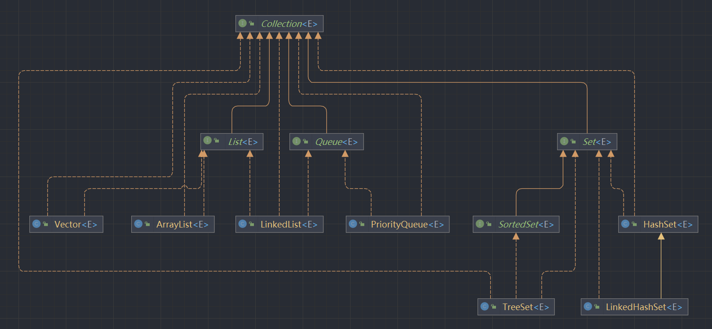
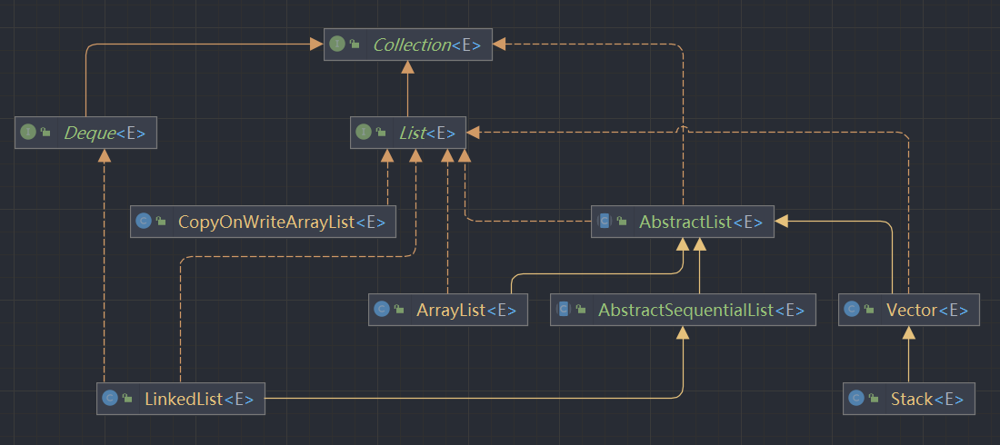
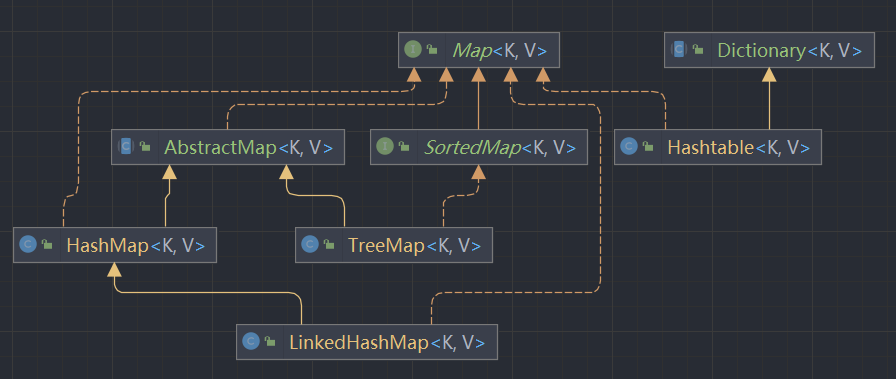

# Collection



`Collection` 用来存储独立的元素, 其中包括 `List`、`Set` 和 `Queue`; 

他们的特点如下

- `List` 按照插入的顺序保存元素
- `Set` 中不能有重复的元素
- `Queue` 按照排队规则来处理容器中的元素

## List

`List` 是一种线性的列表结构，它继承自 `Collection` 接口，是一种有序集合

`List` 中的元素可以根据索引进行检索、删除或插入操作。

`List` 接口常用的实现类如下



### ArrayList

`ArrayList` 是基于数组实现的 `List`，是最常见的列表之

特点如下：

- 随机访问效率高（相对于顺序访问）
- 读快写慢；在写的过程中需要涉及元素的移动，因此写操作的效率比较低；

**随机访问**

随机访问又叫直接访问，在一组长度为n的数据中，要找到其中第i个元素，只需要通过下标i就可以找到

**顺序访问**

在一组长度为n的数据中，要找到其中第i个元素，只能从头或者从尾开始遍历，知道找到第i个元素，需要一次查找i或者n-i次

> 数组就是随机访问结构。数组在内存中占用连续的存储空间，并且数据块的长度是相同的；
> 
> 所以，我们可以通过知道一个起始地址和数据长度，和需要访问的下标，就可以算出数据块的地址
> 
> 公式：`i的元素地址 = 起始地址 + 数据长度 * i`
> 
> 例如：一个 int 类型数据，在 Java 中长度是4个字节（32位），假设它的起始地址是`0x00000001`；
> 
> 那么这个数组有n条数据：`0x00000001`、`0x00000033`、`0x00000065`、`0x00000097`...
> 
> 假设我们限制需要访问下表为2的数据地址，那么公式为：`1 + 32 * 2 = 65`，这样我们就可以找到 `0x00000065` 的数据块
> 

#### 属性

- `DEFAULT_CAPACITY = 10;` 默认的初始化容量
- `Object[] EMPTY_ELEMENTDATA = {};` 用于创建`elementData`空实例数组
- `Object[] DEFAULTCAPACITY_EMPTY_ELEMENTDATA = {}` 在无参构造时标记第一次add需要扩容多少(第一次扩容10个)
- `transient Object[] elementData;` 用来存放列表的数据
- `int size;` 数组中实际的存储的数据量

#### 构造方法

1. `ArrayList()`

```java
public ArrayList() {
    this.elementData = DEFAULTCAPACITY_EMPTY_ELEMENTDATA;
}
```

> 创建时，会将 `DEFAULTCAPACITY_EMPTY_ELEMENTDATA` 赋值给 `elementData`，也就是创建一个长度为0的数组
>  
> 无参构造初始化不会默认设置长度，每次add时会做扩容校验，如果需要扩容时会进行数组拷贝

2. `ArrayList(Collection<? extends E> c)`

```java
public ArrayList(Collection<? extends E> c) {
    elementData = c.toArray();
    if ((size = elementData.length) != 0) {
        // c.toArray might (incorrectly) not return Object[] (see 6260652)
        if (elementData.getClass() != Object[].class)
            elementData = Arrays.copyOf(elementData, size, Object[].class);
    } else {
        // replace with empty array.
        this.elementData = EMPTY_ELEMENTDATA;
    }
}
```

> 在初始化构造方法时，会将形参拷贝一份到 `elementData` 中
> 
> 然后校验如果传递进来的形参数据长度不为0的时候，并且节点类型是Object时会进行特殊拷贝一份，
> 上面注释说`c.toArray()`可能返回的数据不正确
> 
> 否则会将 `elementData` 替换为空数组
>

3. `ArrayList(int initialCapacity)`

```java
public ArrayList(int initialCapacity) {
    if (initialCapacity > 0) {
        this.elementData = new Object[initialCapacity];
    } else if (initialCapacity == 0) {
        this.elementData = EMPTY_ELEMENTDATA;
    } else {
        throw new IllegalArgumentException("Illegal Capacity: "+
                                           initialCapacity);
    }
}
```

> 用于创建一个指定长度的数组

#### 方法

`add(E e)`

```java
public boolean add(E e) {
    ensureCapacityInternal(size + 1);  // Increments modCount!!
    elementData[size++] = e;
    return true;
}
```

> add 方法的作用是将数据添加到集合的数组中
> 
> 首先会调用 `ensureCapacityInternal` 进行扩容，然后会在数据长度+1的下标上引用数据e

`ensureCapacityInternal(int minCapacity)`

```java
private void ensureCapacityInternal(int minCapacity) {
    if (elementData == DEFAULTCAPACITY_EMPTY_ELEMENTDATA) {
        minCapacity = Math.max(DEFAULT_CAPACITY, minCapacity);
    }

    ensureExplicitCapacity(minCapacity);
}
```

> 此方法作用于获取最小数组容量，根据默认容量和当前数组已用长度+1取最大值

`ensureExplicitCapacity(int minCapacity)`

```java
private void ensureExplicitCapacity(int minCapacity) {
    modCount++;

    // overflow-conscious code
    if (minCapacity - elementData.length > 0)
        grow(minCapacity);
}
```

> 首先这里调用了 `modCount++;`，它的作用是标识集合修改次数，例如扩容、删除等
> 
> 然后校验最小需要的容量 - 当前数组的长度 大于0则开始真正的扩容
> 

`grow(int minCapacity)`

```java
private void grow(int minCapacity) {
    // overflow-conscious code
    int oldCapacity = elementData.length;
    int newCapacity = oldCapacity + (oldCapacity >> 1);
    if (newCapacity - minCapacity < 0)
        newCapacity = minCapacity;
    if (newCapacity - MAX_ARRAY_SIZE > 0)
        newCapacity = hugeCapacity(minCapacity);
    // minCapacity is usually close to size, so this is a win:
    elementData = Arrays.copyOf(elementData, newCapacity);
}
```

> 真正扩容的地方，扩容的数量是 `当前数组的长度的1.5倍`

`remove(int index)`

```java
public E remove(int index) {
    rangeCheck(index);

    modCount++;
    E oldValue = elementData(index);

    int numMoved = size - index - 1;
    if (numMoved > 0)
        System.arraycopy(elementData, index+1, elementData, index,
                         numMoved);
    elementData[--size] = null; // clear to let GC do its work

    return oldValue;
}
```

> rangeCheck 校验是否数组越界
> 
> 然后找到需要删除的数据 `oldValue` 后进行数组拷贝（这里就是删除慢的原因）

`get(int index)`

```java
public E get(int index) {
    rangeCheck(index);

    return elementData(index);
}
```

> 在调用 get 方法时，是直接根据下标访问了数组的元素，这也是读取快的原因

`elementData(int index)`

```java
E elementData(int index) {
    return (E) elementData[index];
}
```

> 直接访问数组中的一个元素

# Map



用于存储 `<键, 值>` 对，这个容器允许通过键来查找值 