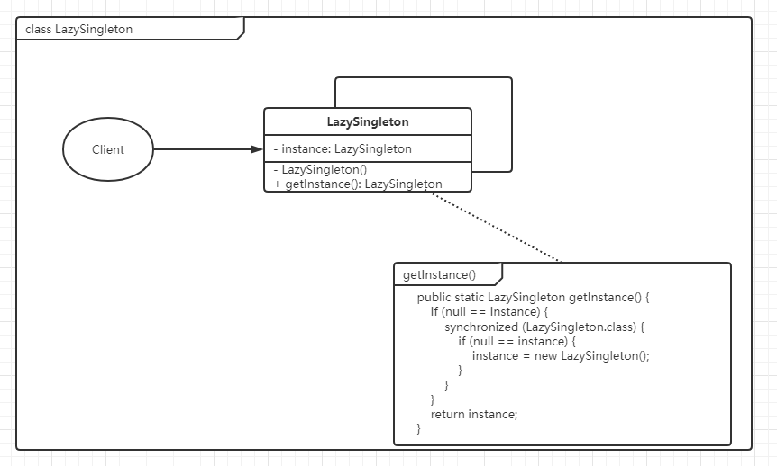

> 一个类只能创建一个对象

# 饿汉式

```java
public class HungerSingleton {
    private static final HungerSingleton HUNGER_SINGLETON = new HungerSingleton();
    
    private HungerSingleton() {
    }
    
    public static HungerSingleton getInstance() {
        return HUNGER_SINGLETON;
    }

    public void exec() {
        System.out.println("HungerSingleton");
    }

    public static void main(String[] args) {
        HungerSingleton instance = HungerSingleton.getInstance();
        instance.exec();
    }

}
```

> 饿汉式在类加载期间，就已经将对象创建完毕，所以是天然的线程安全；
> 
> 但缺点也很明显，它不支持懒加载

# 懒汉式

## 角色

- Singleton：单例类，定义一个静态私有的属性 `instance`，客户端通过`getInstance()`方法获取到实例
- 
## 类图



## 示例代码

```java
public class LazySingleton {

    private static volatile LazySingleton instance;

    private LazySingleton() {
    }

    public static LazySingleton getInstance() {
        if (null == instance) {
            synchronized (LazySingleton.class) {
                if (null == instance) {
                    instance = new LazySingleton();
                }
            }
        }
        return instance;
    }

    public void exec() {
        System.out.println("LazySingleton");
    }

    public static void main(String[] args) {
        LazySingleton singleton = LazySingleton.getInstance();
        singleton.exec();
    }

}

```

> 懒汉式相对于饿汉式多了了懒加载的优势
> 
> `volatile`关键字的作用于防止构造函数还未初始化完毕，就被另一个线程使用，所以加上此关键字实现禁止指令重排序，但在`jdk1.8`版本中，已经保证了创建对象的原子性，所以也可以不加
> 
> 在`getInstance()`方法中，使用了双重检查的方式获取对象。
> 
> 第一层判断的好处在于：不用每次获取实例都加锁，如果为空的时候才进行拿锁操作；
> 
> 第二层判断：考虑到并发操作，第一层判断可能会同时进来很多线程，那么在锁内部再次判断即可避免重复创建对象

# 枚举单例

```java
public enum EnumSingleton {
    INSTANCE;

    public void exec() {
        System.out.println("EnumSingleton");
    }

    public static void main(String[] args) {
        EnumSingleton.INSTANCE.exec();
    }
}
```

> 枚举单例使用了java的枚举特性（每个枚举在JVM中都是唯一的）保证了多线程安全和唯一性

# 内部类

```java
public class InternalSingleton {
    private InternalSingleton() {
    }

    private static class SingletonHolder {
        public static final InternalSingleton INTERNAL_SINGLETON = new InternalSingleton();
    }

    public void exec() {
        System.out.println("InternalSingleton");
    }

    public static InternalSingleton getInstance() {
        return SingletonHolder.INTERNAL_SINGLETON;
    }

    public static void main(String[] args) {
        InternalSingleton instance = InternalSingleton.getInstance();
        instance.exec();
    }
}
```

> 静态内部类的方式支持懒加载和高并发，并且实现起来相对简单
> 
> 在`InternalSingleton`被加载时，并不会加载`SingletonHolder`；
> 
> 只有在调用`getInstance()`方法时，才会加载；
> 
> 而创建对象的线程安全，都有jvm来保证

